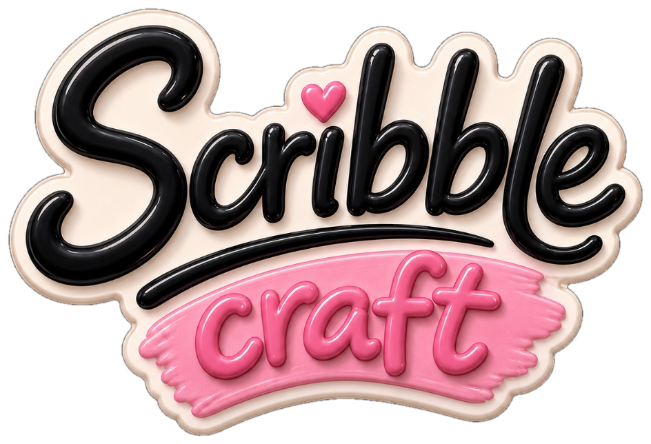

<p align="center">
  
</p>

<h1 align="center">🎨 ScribbleCraft</h1>

<p align="center">
  <em>An Excalidraw-like collaborative whiteboard built with React, TypeScript, and WebRTC. Features organic Google handwriting fonts, realistic paper sticky notes, live multi-user collaboration with remote cursors, and zero-login access.</em>
</p>

---

## 📦 Technologies

- **Vite**: Ultra-fast frontend build tooling and HMR
- **React.js (v19)**: Component-based UI library
- **TypeScript**: Type-safe frontend architecture
- **PeerJS (WebRTC)**: Peer-to-peer data channels with Google STUN servers for cross-device real-time sync
- **BroadcastChannel API**: Instant zero-latency tab-to-tab synchronization on the same device
- **Canvas 2D API**: High-performance rendering for freehand drawing, lines, and geometric shapes
- **Google Fonts API**: Dynamic on-demand font stylesheet injection for authentic handwriting styles
- **Lucide React**: Crisp and modern icons
- **Vanilla CSS3**: Sleek glassmorphism, floating toolbars, and responsive UI micro-animations
- **Oxlint**: High-speed JavaScript/TypeScript linter

---

## 🦄 Features

Here's what you can do with **ScribbleCraft**:

- **Choose a Tool**: Pencils, lines, arrows, rectangles, diamonds, ellipses, text, sticky notes, and eraser. Pick one and start creating immediately.
- **Custom Paper Sticky Notes**: Realistic paper notes featuring washi tape pins, organic rotational tilts, customizable paper pastel colors, and rich inline text editing.
- **Dynamic Google Handwriting Fonts**: Switch between authentic handwriting styles on the fly (*Kalam*, *Architects Daughter*, *Caveat*, *Indie Flower*, *Patrick Hand*, *Reenie Beanie*, and more).
- **Live Multi-User Collaboration**:
  - **No Login / Sign-Up Required**: Open to any user immediately.
  - **Shareable Room Links**: Click "Share Room" to copy a direct link (`?room=scribble-xyz123`).
  - **Live Remote Cursors**: See collaborators' mouse pointers with real-time motion, custom vibrant colors, and user badges.
  - **Instant State Synchronization**: Shape creations, freehand drawing, sticky note edits, moving elements, and canvas clears sync in real time across devices and tabs.
- **Multi-Board Management**: Create, rename, switch between, and persist multiple whiteboard boards locally.
- **Export & Import**: Download your canvas as PNG, SVG, or backup JSON files, and easily import previously saved JSON boards.
- **Smooth Pan & Zoom**: Navigate large diagrams with precision zoom (20% to 400%) and hand panning.

---

## 🎯 Keyboard Shortcuts

Speed up your workflow with these shortcuts:

| Action | Shortcut |
| :--- | :--- |
| **Selection Tool** | `1` or `V` |
| **Pan / Hand Tool** | `2` or `H` *(or hold Space bar / Middle Click)* |
| **Rectangle** | `3` or `R` |
| **Diamond** | `4` or `D` |
| **Ellipse** | `5` or `O` |
| **Arrow** | `6` or `A` |
| **Line** | `7` or `L` |
| **Pencil (Freehand)** | `8` or `P` |
| **Text Tool** | `9` or `T` |
| **Sticky Note** | `0` or `S` |
| **Eraser** | `E` |
| **Undo** | `Ctrl + Z` |
| **Redo** | `Ctrl + Y` or `Ctrl + Shift + Z` |
| **Zoom In / Out** | `Ctrl + Mouse Wheel` |

---

## 👩🏽‍🍳 The Process

1. **Canvas & Drawing Foundation**:  
   Started by building an HTML5 Canvas rendering engine supporting freehand sketching, geometric shapes, dashed strokes, fill patterns, and selection bounding boxes.

2. **Hybrid Canvas + DOM Overlay Architecture**:  
   To make sticky notes look and feel like real paper with native selection, text wrapping, and tape styling, implemented a synchronized DOM overlay layer transformed with exact canvas pan and zoom coordinates.

3. **Google Handwriting Fonts Integration**:  
   Engineered a dynamic font loader that fetches Google Fonts CSS on the fly whenever a user switches fonts in the inspector panel or types on a sticky note.

4. **Real-Time WebRTC & BroadcastChannel Collaboration**:  
   Built `CollaborationService` combining BroadcastChannel (for instant multi-tab sync on the same computer) and PeerJS WebRTC DataChannels with Google STUN servers (for seamless cross-device communication across the internet without a custom backend server).

5. **Multi-Board Management & State History**:  
   Implemented undo/redo history stacks and local storage persistence for multi-board organization (`board1`, `board2`, etc.), as well as JSON/PNG/SVG export pipelines.

6. **Vercel Deployment & SPA Routing**:  
   Configured `vercel.json` rewrite routing so any generated room link (`?room=XYZ`) loads the single-page application cleanly without 404 errors.

---

## 📚 What I Learned

During this project, I gained deep practical experience with advanced browser APIs, geometric math, and real-time networking:

- 🧠 **WebRTC P2P DataChannels & STUN Signaling**:  
  Understanding how WebRTC peer discovery, ICE candidates, and STUN servers work to establish direct browser-to-browser data streams without backend websocket servers.

- 📏 **Canvas Transforms & Coordinate Geometry**:  
  Mastering screen-to-canvas coordinate projections: converting mouse client coordinates to transformed canvas space `(clientX - panOffset.x) / zoom` and vice versa for live remote collaborator cursors.

- 🎨 **Hybrid DOM + Canvas Rendering**:  
  Learning how to combine Canvas rendering for high-performance vector graphics with DOM layers for rich text input and accessible UI elements.

- 🎣 **React State & History Management**:  
  Managing undo/redo history arrays, broadcast message loops, and reactive presence lists without race conditions or memory leaks.

- ⚡ **Optimized Bundling & Linting**:  
  Configuring Oxlint and Vite for instantaneous HMR, type-safe development, and sub-second production builds.

---

## 💭 How can it be improved?

- [ ] Add laser pointer presentation mode for remote meetings.
- [ ] Add PDF export and multi-page document pagination.
- [ ] Add audio/voice communication room during live collaboration sessions.
- [ ] Add customizable shape templates (flowchart symbols, mind map nodes, wireframe mockups).
- [ ] Add dark mode canvas theme toggle.

---

## 🚦 Running the Project Locally

Follow these steps to run ScribbleCraft on your local machine:

1. **Clone the repository**:
   ```bash
   git clone https://github.com/vidhyawalke/ScribbleCraft.git
   cd ScribbleCraft
   ```

2. **Install dependencies**:
   ```bash
   npm install
   ```

3. **Start the development server**:
   ```bash
   npm run dev
   ```

4. Open [http://localhost:5173](http://localhost:5173) in your web browser to start sketching!

---

## 🌐 Deploying to Vercel

1. Push your changes to GitHub.
2. Import the repository in [Vercel](https://vercel.com).
3. Framework Preset: **Vite**.
4. Click **Deploy**. (The included `vercel.json` handles all room routing automatically).
